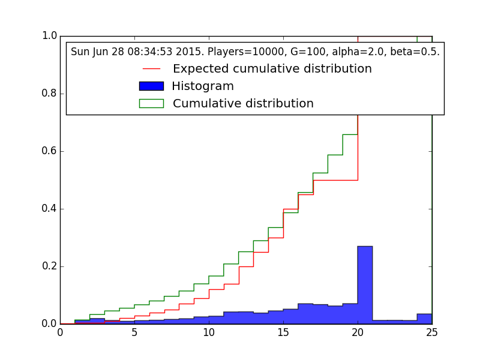
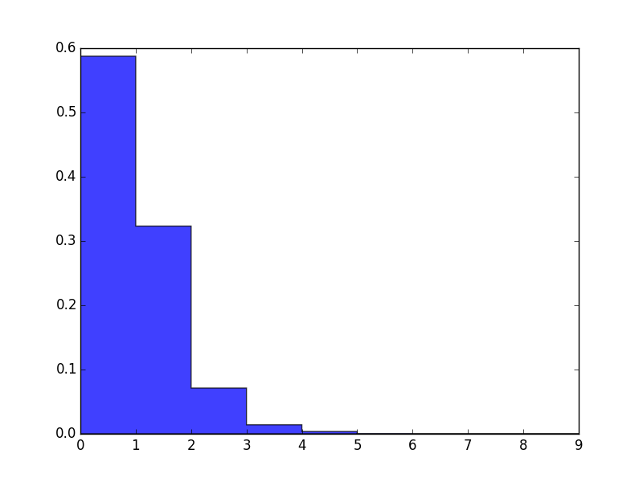
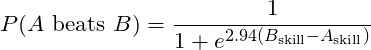

<!-- START doctoc generated TOC please keep comment here to allow auto update -->
<!-- DON'T EDIT THIS SECTION, INSTEAD RE-RUN doctoc TO UPDATE -->
**Contents**

- [About](#about)
- [How to use](#how-to-use)
- [How it works](#how-it-works)

<!-- END doctoc generated TOC please keep comment here to allow auto update -->

# About

A script for numerically simulating outcomes on the Hearthstone competitive play ladder. 
I built this to explore whether we can learn anything about skill variations in Hearthstone using only the distribution of ladder ranks. 
The theory is discussed briefly under "how it works," below. 
I've written a longer explanation of my thoughts, .

ladder-sim is written in Python using matplotlib and the Python 2.7 statistics package, but mostly with core modules and built-in functions. 

# How to use

All the functionality of the package is wrapped by the Season class. 
To simulate a season of Ranked play on the ladder, create a new Season object. 
Parameters of Season object (pass to initializer):

* `nplayers`: number of players to simulate
* `G`: desired average number of games per player
* `alpha`: the shape parameter α of the gamma distribution used for player skill
* `beta`: the rate parameter β of the gamma distribution used for player skill

For example, 

	S = Season(10000, 100, 2.0, 0.5)

will create a new Season with 10,000 players playing an average 100 games each, and with skill values drawn from the given distribution. 
(The defaults are such that you'll get the same result with `S = Season(10000)`.)

Once you've initialized the Season with desired parameters, you then want to run the simulation: 

	S.RunSeason()

You should get something like the below: 

	Simulating approx. 503396 games.
	Mean 100 games per player.
	Standard deviation 71.1387186233
	Percent: [===================================== ] 99%
	503394 games simulated in 70.517105seconds (0.000140083324394 seconds per game).

As you can see, the simulation of 10,000 players *times* 100 games takes about 70s on my machine. 

Once you've run the simulation, you can display some analytics about the results: 

* `S.PlotRanks()`: display a histogram of the ladder rankings produced by the simulation, along with the reported actual distribution for comparison ([see](http://us.battle.net/hearthstone/en/forum/topic/16858985939)). 

* `S.PlotSkills()`: display a histogram of skill distribution in the simulated player population. The scale is a renormalized Elo scale where a difference of 1.0 gives a 95% chance to win. 

# How it works

I've implemented all the public features of the Hearthstone ladder *verbatim* (see Issues for exceptions). 
Ranks 25-Legend, Stars, Win Streaks are all included and AFAICT handled exactly as on Battle.net. 

The main substantial assumption is the relationship between skill and winning. 
The script determines the outcome of a game according to the following formula: 

2.94 is a normalizing constant so that each 1-point gap in skill corresponds to an odds ratio of 19:1 (skill level 1 has a 95% chance to beat skill level 0). 

With this model, varying the distribution of skill in the player population corresponds to varying how much outcomes are dependent on skill. 
If skills are widely dispersed in the population, then outcomes are highly dependent on skill -- if there are 5s and 1s playing each other, 5s will win an astronomical majority of the time. 
Conversely, if the skill distribution is compressed, then outcomes will more often be determined by luck. 
When skill is measured this way, the dispersion of skill in the population is a proxy for how skill-vs.-luck-based the game is, a common area of controversy in gaming. 